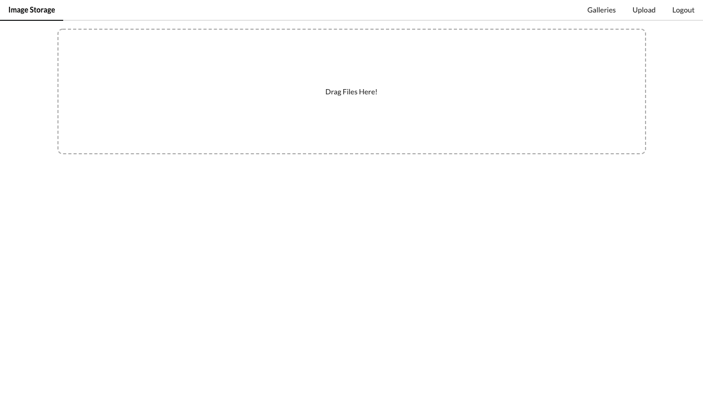
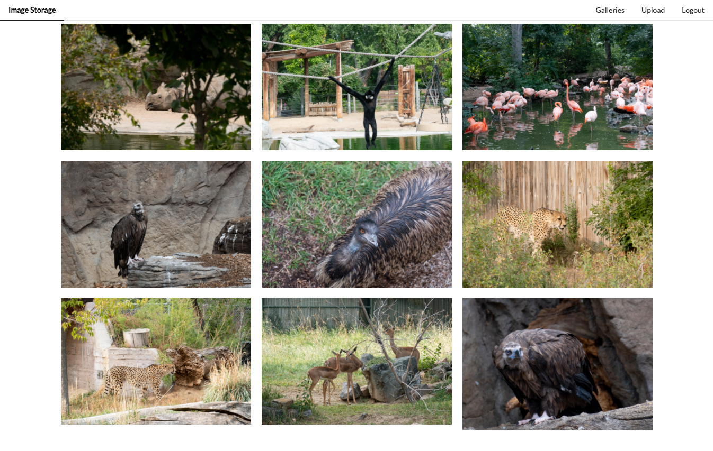

# Overview

This Vue.js application includes user authentication using OAuth2 tokens to verify a user's Imgur Account. Once verified, the user can either click to upload or drag and drop multiple images, as well as navigate to and view their gallery of images. When they're finished, they can logout.

## Technologies
- Vue.js
- HTML
- CSS

## Integrations
- axios
- Lodash
- Vue Router
- Vuex
- Imgur API
- Semantic UI

## How To Get Started
- Clone this github repo by using: 
git clone https://github.com/raynamcginnis/Image-Storage.git

- Run the application by using: 

npm run serve
